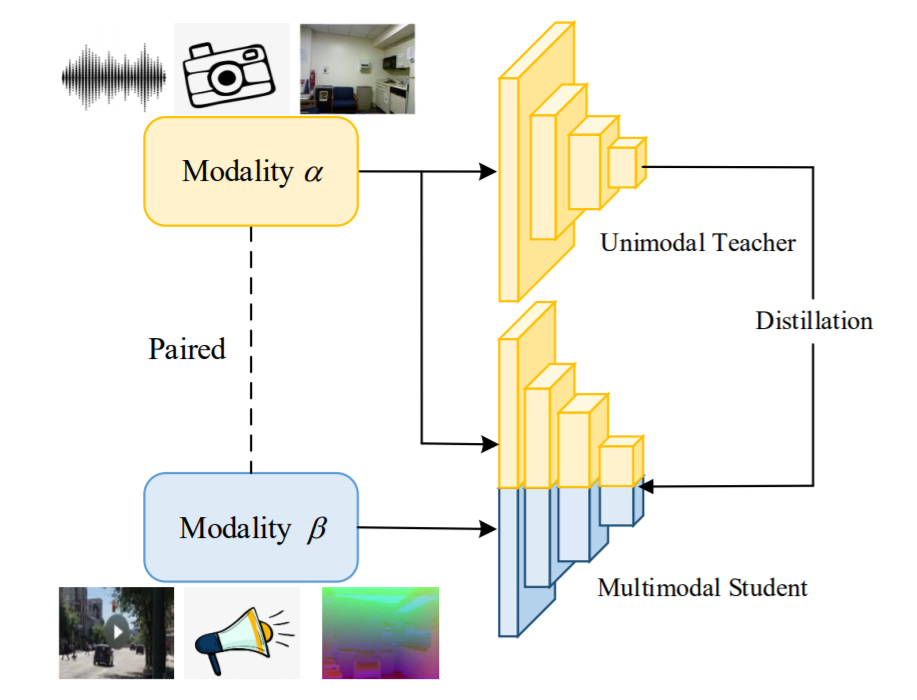
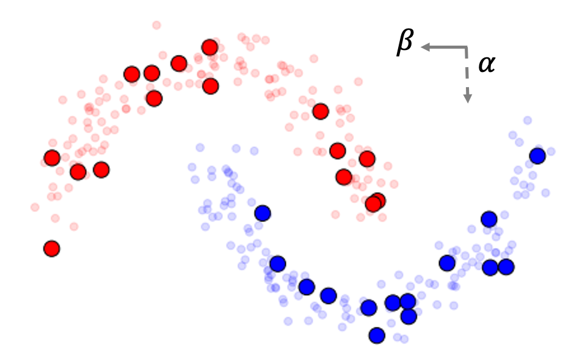

# MKE
### [ICCV 2021] Multimodal Knowledge Expansion (MKE)
This repo provides the implementation of the following ICCV 2021 paper:
"Multimodal Knowledge Expansion" (MKE). [Paper](https://arxiv.org/abs/2103.14431), [Project Page](https://tsinghua-mars-lab.github.io/MKE/).



### (1) TwoMoon Example

We generate sythetic TwoMoon data. The data located at the upper moon and lower moon have true labels 0 and 1, and are colored by red and blue, respectively.
Two modalities (α and β) are interpreted as observing from the X-axis and Y-axis.



```
Code: see TwoMoon/mke.ipynb
```


### (2) RAVDESS Emotion Recogntion

Image + Audio emotion recognition

Dataset:
The Ryerson Audio-Visual Database of Emotional Speech and Song (RAVDESS). [[link]](https://zenodo.org/record/1188976#.YG6fBy8RrUo)

